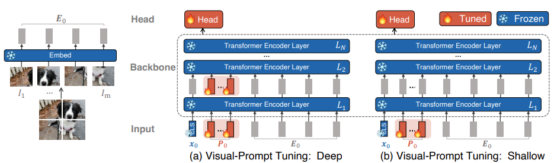

최근 성능이 좋은 거대 모델이 쏟아지며 많은 분야에서 기술적 혁신이 일어나고 있습니다.

그러나 이러한 거대모델을 일반인 또는 연구실 그리고 대부분의 기업에서 만들기는 정말 쉽지 않습니다. 

따라서 현재 나온 거대 모델을 사용하며, 낮은 컴퓨팅 자원을 통해 원하는 방향으로 성능을 향상시키는 방법을 찾다 Visual Prompt Tuning(VPT)에 대해 알게되었습니다. 

논문의 사진에서 볼 수 있듯  VPT는 Linear Probing과 같이 기존의 다양한 transfer learning 방법에 비해 성능이 높으며 

심지어 Full fine-tunning 방법보다도 성능이 좋습니다. 

Full: Pretrain된 모델의 파라미터를 학습 시키는 것
Linear: Classification Layer에 Fully connected layer만 추가하여 학습하는 것
Partial: 백복의 마지막 k개 Layer만 fine-tune을 진행
MLP: 단순한 Linear layer 대신 k개의 Multi-Layer Perceptron(MLP)를 추가하여 학습하는 것
Sidetune: pretrain된 모델의 사이에 학습 가능한 네트워크를 추가하여 학습을 진행하는 것
Adpater: Pretrain된 Transformer의 내부에 새로운 MLP 모듈들을 추가하고 Residual-connection하여 fine-tune을 진행
Bias: Pretrain된 모델의 backbone의 Bias만 fine-tune 하는 것
VPT는 NLP 분야에서 거대모델의 성능을 향상하는 방식에서 착안하여 Vision 분야에 적용했다고 합니다.

 

그렇다면 VPT는 어떤 방법으로 성능을 높이는 걸까요? 

논문에서 제시한 학습 방법에 대한 사진은 위와 같습니다. 기존의 Pretrain된 모델을 Head를 제외한 CLS & Encoder를 Freeze시킨 후 입력 token과 같은 크기의 학습가능한 Prompt를 추가하여 학습을 진행합니다. Prompt라고 했지만 그냥 학습가능한 token으로 생각하셔도 무방할 듯 합니다!!

(a) Visual-Prompt Tuning: 각 Layer마다 학습가능한 Prompt를 배치하여 학습을 진행합니다

(b) Visual-Prompt Tuning: Shallow: 입력 부분에만 학습 가능한 Prompt를 배치하여 학습을 진행합니다.

위 그림을 식으로 나타내면 아래와 같습니다.

 

사실 처음 논문의 학습 방법을 보고 어쩌다 해당 방법이 채택된 것인지 궁금했는데 실험 부분에서 그 해답을 얻을 수 있었습니다.

해당 실험 부분은 아래와 같습니다.

Prompt를 Pretrain된 모델의 token과 더해주는 방식인 Add
Embed Layer를 거치기 전 Pixel level에 적용하는 Prepend-pixel
이미지의 Channel에 Prompt를 concat해주는 Concat-channel
위 내용과 같이 여러 실험을 통해 나온 구조라는 것을 알게 되었습니다. 

Meta의 논문을 보면 실험을 정말 알차게 한다는 생각을 많이 하게 되는 것 같습니다. 읽는 사람이 원하는 정보를 포함한 실험 내용을 잘 담는 것을 보며 많이 배우게 되는 것 같습니다!! 