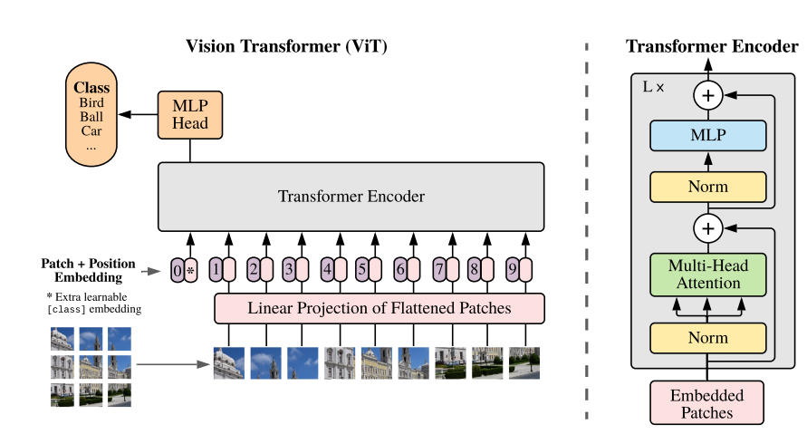
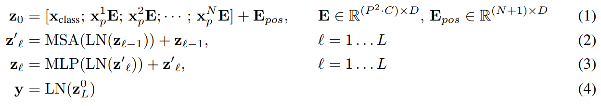

# ViT 내용

- NLP 분야에서 사용한 Transformer를 Computer Vision 분야에 적용시킴

- 논문(https://arxiv.org/abs/2010.11929)

- 사진과 같이 Transformer Encoder를 사용하며, NLP에 사용한 transformer의 input과 비슷한 형태를 적용하기 위해 이미지를 Patch로 분리하여 적용함.
- (Patch를 만들 때 conv를 사용하면 성능이 좀 더 상승한다는 말이 있음)
- Patch를 flatten 및 Linear projection하고, cls 토큰과 Positional embadding을 추가함
- cls 토큰은 NLP의 BERT 모델에서 사용하는 방식과 같음
- 이후 Transformer Encoder에 들어가는데 이때, Layer Norm을 거친 후 q(query), k(key), v(value)로 분리함
- 분리된 q, k, v는 Multi-Head Self-Attention(MLP)에 들어가기 위해 지정한 Head의 갯수에 맞게 쪼갬
- 쪼개진 후 q, k를 내적한 후 Softmax를 취하고 해당 값을 v와 행렬곱 함.(내적은 상관관계를 알기위해 진행함)
- 행렬곱을 통해 얻은 값을 다시 원본 크기로 압축한 후 Liear Projection을 진행
- 이후 skip-connection을 통해 입력값을 더해준 후 Multi-Layer Perceptron(MLP)에 들어감
- MLP를 거친 후 MLP의 입력값을 다시 한번 skip-connection을 통해 더해주며 마무리함
- 위 과정을 식으로 나타내면 아래 사진과 같음

위 과정을 L번 반복하며 학습을 진행함 (prac.ipynb 파일에서 depth에 해당)

- ViT 모델은 적은 데이터셋에서는 CNN에 비해 낮은 성능을 보이나 데이터셋이 많아질 경우 더 높은 성능을 보임